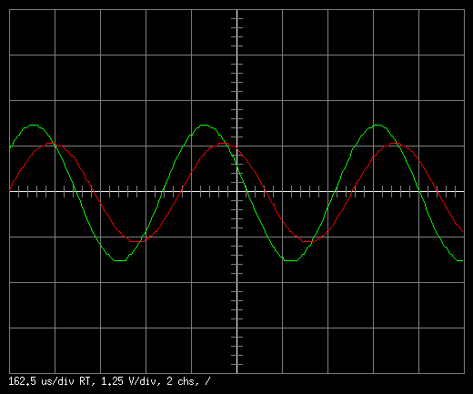
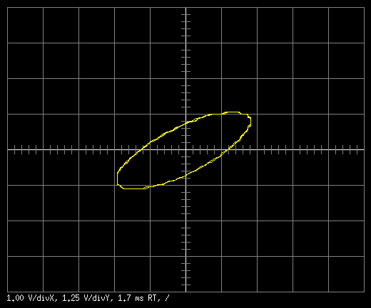

# ascope
An Arduino Uno oscilloscope.

## Features
* real-time sampling rates up to 300 kSps,
* equivalent-time sampling rates up to 16 MSps,
* trigger on rising or falling edge, or auto,
* 8-bit resolution,
* up to 4 channels.

## The principle of operation
The oscilloscope takes its input from the analog pins A0, A1, etc. In
the normal mode, acquisition is triggered when an AC interrupt occurs.
In the auto-trigger mode, acquisition starts immediately.

In the real-time sampling mode, the ADC is free-running. AC ISR polls
the ADC for conversion results and fills the output buffers. Sampling
rate is switched by changing the ADC clock division factor.

In the equivalent-time sampling mode, the time interval between an AC
interrupt and ADC conversion is measured with the 16-bit Timer/Counter1.
The conversion is triggered by the TC1 output compare match. ADC ISR
reads the conversion result and schedules the next one. Sampling rate is
switched by changing the TC1 clock division factor.

## Indication
The onboard LED is turned on while the acquisition is in progress.

## Limitations
The analog bandwidth of the Arduino ADC input circuits is not much above
100 kHz. Signals of higher frequency are considerably distorted.

## Input signal conditioning
Since the Arduino ADC accepts input in the range 0..5 V only, an
external circuit is needed to buffer and fit input signals to the range
suitable for the ADC. We use the following circuit for -5..+5 V inputs:

## Calibration output
The sketch contains provisions for producing square waveforms in the
wide range of frequencies (from 500 Hz to 500 kHz), which might be
useful for testing and calibration of the oscilloscope in the absence of
an external signal generator.

## Control and data exchange protocol
The oscilloscope takes its settings from a single-byte control word:

and returns data in the following order:

See the source code for details.

## Control software
We provide a simple control program for Unix-like operating systems with
X11 graphics. It uses just plain `Xlib` and `libpng`. The program is
controlled mostly from keyboard:

## Examples
Two 1.6 kHz sine waves, sampled at 150 kSps real-time:

The same signals, plotted in XY mode:

A multivibrator running at 35 kHz, sampled at 2 MSps equivalent-time:

## Customization
The sketch and the control program are designed to be customized easily.
Most parameters are set with `#define` or `const` directives. The
sources contain a large number of comments.

## License
MIT.
